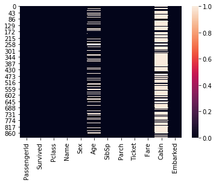
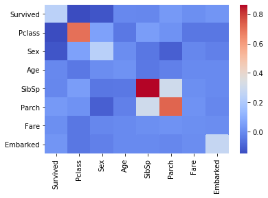
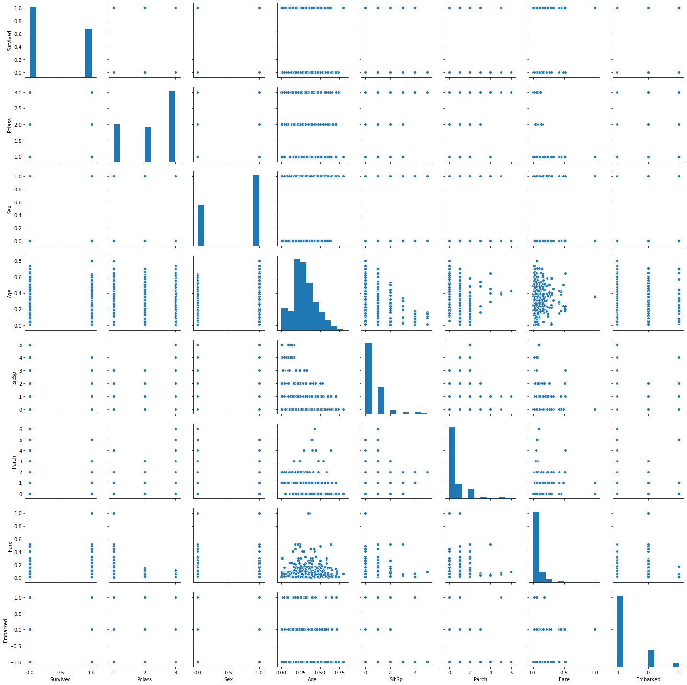
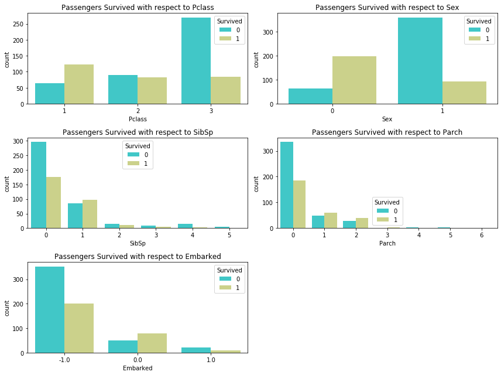
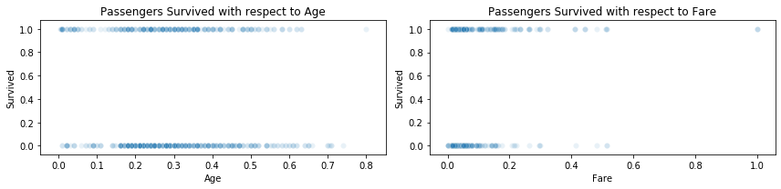

# Machine Learning Engineer Nanodegree
## Introduction and Foundations
## Project 0: Titanic Survival Exploration

This porject is for Udacity Machine Learning Engineer Nanodegree and It is modified, solved and imporved by [Javad Ebadi](https://github.com/javadebadi)

RMS Titanic was a British passenger liner that sank in the North Atlantic Ocean in 1912 after the ship struck an iceberg during her maiden voyage from Southampton to New York City. Of the estimated 2,224 passengers and crew aboard, more than 1,500 died, making it one of modern history's deadliest peacetime commercial marine disasters. RMS Titanic was the largest ship afloat at the time she entered service and was the second of three Olympic-class ocean liners operated by the White Star Line. She was built by the Harland and Wolff shipyard in Belfast. Thomas Andrews, chief naval architect of the shipyard at the time, died in the disaster.
[Reference](https://en.wikipedia.org/wiki/RMS_Titanic.jpg=1x1)


In this notebook, we are going to find the features that can predict the survival of a passenger. 

There is a famous movie about Titanic and you may be familira with that. If you have watche then this video is nostalgic for you (click to paly from YouTube):

[](https://youtu.be/ItjXTieWKyI)

# Getting, cleaning and pre-processing data

To begin working with the RMS Titanic passenger data, we'll first need to `import` the packages.


```python
import numpy as np
import pandas as pd
import matplotlib.pyplot as plt
import seaborn as sns

# Read the dataset
dataset_path = "./titanic_data.csv"
df = pd.read_csv(dataset_path)
df.head()
```

From a sample of the RMS Titanic data, we can see the various features present for each passenger on the ship:
- **Survived**: Outcome of survival (0 = No; 1 = Yes)
- **Pclass**: Socio-economic class (1 = Upper class; 2 = Middle class; 3 = Lower class)
- **Name**: Name of passenger
- **Sex**: Sex of the passenger
- **Age**: Age of the passenger (Some entries contain `NaN`)
- **SibSp**: Number of siblings and spouses of the passenger aboard
- **Parch**: Number of parents and children of the passenger aboard
- **Ticket**: Ticket number of the passenger
- **Fare**: Fare paid by the passenger
- **Cabin** Cabin number of the passenger (Some entries contain `NaN`)
- **Embarked**: Port of embarkation of the passenger (C = Cherbourg; Q = Queenstown; S = Southampton)


Missing valuse need to be handled in every data analysis problem. We use `seaborn`'s `heatmap` to investigate the missing values in our dataset.


```python
# looking for missing values in the dataset
sns.heatmap(df.isna())
```


    <matplotlib.axes._subplots.AxesSubplot at 0x7f26326b67b8>





The Cabin and Age column have missing values. In particular the Cabin column has is mainly cotains missing values than non-missing. Thus we have to remove that column from out dataset for now. 
In addition, we drop the record with missing Age. The reason, we don't drop the Age column is that we think Age is an important parameter in predicting survival. We will re-investiage this prior later.


```python
df = df.drop(columns=['Cabin'])
df.head()
```


<div>
<style scoped>
    .dataframe tbody tr th:only-of-type {
        vertical-align: middle;
    }

    .dataframe tbody tr th {
        vertical-align: top;
    }

    .dataframe thead th {
        text-align: right;
    }
</style>
<table border="1" class="dataframe">
  <thead>
    <tr style="text-align: right;">
      <th></th>
      <th>PassengerId</th>
      <th>Survived</th>
      <th>Pclass</th>
      <th>Name</th>
      <th>Sex</th>
      <th>Age</th>
      <th>SibSp</th>
      <th>Parch</th>
      <th>Ticket</th>
      <th>Fare</th>
      <th>Embarked</th>
    </tr>
  </thead>
  <tbody>
    <tr>
      <th>0</th>
      <td>1</td>
      <td>0</td>
      <td>3</td>
      <td>Braund, Mr. Owen Harris</td>
      <td>male</td>
      <td>22.0</td>
      <td>1</td>
      <td>0</td>
      <td>A/5 21171</td>
      <td>7.2500</td>
      <td>S</td>
    </tr>
    <tr>
      <th>1</th>
      <td>2</td>
      <td>1</td>
      <td>1</td>
      <td>Cumings, Mrs. John Bradley (Florence Briggs Th...</td>
      <td>female</td>
      <td>38.0</td>
      <td>1</td>
      <td>0</td>
      <td>PC 17599</td>
      <td>71.2833</td>
      <td>C</td>
    </tr>
    <tr>
      <th>2</th>
      <td>3</td>
      <td>1</td>
      <td>3</td>
      <td>Heikkinen, Miss. Laina</td>
      <td>female</td>
      <td>26.0</td>
      <td>0</td>
      <td>0</td>
      <td>STON/O2. 3101282</td>
      <td>7.9250</td>
      <td>S</td>
    </tr>
    <tr>
      <th>3</th>
      <td>4</td>
      <td>1</td>
      <td>1</td>
      <td>Futrelle, Mrs. Jacques Heath (Lily May Peel)</td>
      <td>female</td>
      <td>35.0</td>
      <td>1</td>
      <td>0</td>
      <td>113803</td>
      <td>53.1000</td>
      <td>S</td>
    </tr>
    <tr>
      <th>4</th>
      <td>5</td>
      <td>0</td>
      <td>3</td>
      <td>Allen, Mr. William Henry</td>
      <td>male</td>
      <td>35.0</td>
      <td>0</td>
      <td>0</td>
      <td>373450</td>
      <td>8.0500</td>
      <td>S</td>
    </tr>
  </tbody>
</table>
</div>


```python
df = df[df['Age'].isnull() == False]
```

### Categories to numerics

Some columns such as Sex and Embarked are in string format and they have only handful of values. Therefore, to use information of them in the analysis we need to convert them to numerics.


```python
df['Sex'].replace(['female','male'],[0,1],inplace=True)
df['Embarked'].replace(['S','C','Q'],[-1,0,1],inplace=True)
df.head()
```


<div>
<style scoped>
    .dataframe tbody tr th:only-of-type {
        vertical-align: middle;
    }

    .dataframe tbody tr th {
        vertical-align: top;
    }

    .dataframe thead th {
        text-align: right;
    }
</style>
<table border="1" class="dataframe">
  <thead>
    <tr style="text-align: right;">
      <th></th>
      <th>PassengerId</th>
      <th>Survived</th>
      <th>Pclass</th>
      <th>Name</th>
      <th>Sex</th>
      <th>Age</th>
      <th>SibSp</th>
      <th>Parch</th>
      <th>Ticket</th>
      <th>Fare</th>
      <th>Embarked</th>
    </tr>
  </thead>
  <tbody>
    <tr>
      <th>0</th>
      <td>1</td>
      <td>0</td>
      <td>3</td>
      <td>Braund, Mr. Owen Harris</td>
      <td>1</td>
      <td>22.0</td>
      <td>1</td>
      <td>0</td>
      <td>A/5 21171</td>
      <td>7.2500</td>
      <td>-1.0</td>
    </tr>
    <tr>
      <th>1</th>
      <td>2</td>
      <td>1</td>
      <td>1</td>
      <td>Cumings, Mrs. John Bradley (Florence Briggs Th...</td>
      <td>0</td>
      <td>38.0</td>
      <td>1</td>
      <td>0</td>
      <td>PC 17599</td>
      <td>71.2833</td>
      <td>0.0</td>
    </tr>
    <tr>
      <th>2</th>
      <td>3</td>
      <td>1</td>
      <td>3</td>
      <td>Heikkinen, Miss. Laina</td>
      <td>0</td>
      <td>26.0</td>
      <td>0</td>
      <td>0</td>
      <td>STON/O2. 3101282</td>
      <td>7.9250</td>
      <td>-1.0</td>
    </tr>
    <tr>
      <th>3</th>
      <td>4</td>
      <td>1</td>
      <td>1</td>
      <td>Futrelle, Mrs. Jacques Heath (Lily May Peel)</td>
      <td>0</td>
      <td>35.0</td>
      <td>1</td>
      <td>0</td>
      <td>113803</td>
      <td>53.1000</td>
      <td>-1.0</td>
    </tr>
    <tr>
      <th>4</th>
      <td>5</td>
      <td>0</td>
      <td>3</td>
      <td>Allen, Mr. William Henry</td>
      <td>1</td>
      <td>35.0</td>
      <td>0</td>
      <td>0</td>
      <td>373450</td>
      <td>8.0500</td>
      <td>-1.0</td>
    </tr>
  </tbody>
</table>
</div>


Another thing we expect is that information such as Ticket number, Name and PassengerId are not relevant variables to survival of a passanger (unless you beleive in magic or chance strongly). Thus we remove these columns from our data set too.


```python
df.drop(columns=['PassengerId','Name','Ticket'],inplace=True)
```


```python
df.head()
```


<div>
<style scoped>
    .dataframe tbody tr th:only-of-type {
        vertical-align: middle;
    }

    .dataframe tbody tr th {
        vertical-align: top;
    }

    .dataframe thead th {
        text-align: right;
    }
</style>
<table border="1" class="dataframe">
  <thead>
    <tr style="text-align: right;">
      <th></th>
      <th>Survived</th>
      <th>Pclass</th>
      <th>Sex</th>
      <th>Age</th>
      <th>SibSp</th>
      <th>Parch</th>
      <th>Fare</th>
      <th>Embarked</th>
    </tr>
  </thead>
  <tbody>
    <tr>
      <th>0</th>
      <td>0</td>
      <td>3</td>
      <td>1</td>
      <td>22.0</td>
      <td>1</td>
      <td>0</td>
      <td>7.2500</td>
      <td>-1.0</td>
    </tr>
    <tr>
      <th>1</th>
      <td>1</td>
      <td>1</td>
      <td>0</td>
      <td>38.0</td>
      <td>1</td>
      <td>0</td>
      <td>71.2833</td>
      <td>0.0</td>
    </tr>
    <tr>
      <th>2</th>
      <td>1</td>
      <td>3</td>
      <td>0</td>
      <td>26.0</td>
      <td>0</td>
      <td>0</td>
      <td>7.9250</td>
      <td>-1.0</td>
    </tr>
    <tr>
      <th>3</th>
      <td>1</td>
      <td>1</td>
      <td>0</td>
      <td>35.0</td>
      <td>1</td>
      <td>0</td>
      <td>53.1000</td>
      <td>-1.0</td>
    </tr>
    <tr>
      <th>4</th>
      <td>0</td>
      <td>3</td>
      <td>1</td>
      <td>35.0</td>
      <td>0</td>
      <td>0</td>
      <td>8.0500</td>
      <td>-1.0</td>
    </tr>
  </tbody>
</table>
</div>


To have a better prediction and analysis (especially with Machine Learning methods) it is better (mandatory) to normalize our feature.
To normalize Age column we divide the age by 100. 
To normalize Fare column we use min-max normalization.


```python
# normalize Age
df['Age'] = df['Age']/100.0
df.head()
```


<div>
<style scoped>
    .dataframe tbody tr th:only-of-type {
        vertical-align: middle;
    }

    .dataframe tbody tr th {
        vertical-align: top;
    }

    .dataframe thead th {
        text-align: right;
    }
</style>
<table border="1" class="dataframe">
  <thead>
    <tr style="text-align: right;">
      <th></th>
      <th>Survived</th>
      <th>Pclass</th>
      <th>Sex</th>
      <th>Age</th>
      <th>SibSp</th>
      <th>Parch</th>
      <th>Fare</th>
      <th>Embarked</th>
    </tr>
  </thead>
  <tbody>
    <tr>
      <th>0</th>
      <td>0</td>
      <td>3</td>
      <td>1</td>
      <td>0.22</td>
      <td>1</td>
      <td>0</td>
      <td>7.2500</td>
      <td>-1.0</td>
    </tr>
    <tr>
      <th>1</th>
      <td>1</td>
      <td>1</td>
      <td>0</td>
      <td>0.38</td>
      <td>1</td>
      <td>0</td>
      <td>71.2833</td>
      <td>0.0</td>
    </tr>
    <tr>
      <th>2</th>
      <td>1</td>
      <td>3</td>
      <td>0</td>
      <td>0.26</td>
      <td>0</td>
      <td>0</td>
      <td>7.9250</td>
      <td>-1.0</td>
    </tr>
    <tr>
      <th>3</th>
      <td>1</td>
      <td>1</td>
      <td>0</td>
      <td>0.35</td>
      <td>1</td>
      <td>0</td>
      <td>53.1000</td>
      <td>-1.0</td>
    </tr>
    <tr>
      <th>4</th>
      <td>0</td>
      <td>3</td>
      <td>1</td>
      <td>0.35</td>
      <td>0</td>
      <td>0</td>
      <td>8.0500</td>
      <td>-1.0</td>
    </tr>
  </tbody>
</table>
</div>


```python
# normalize Fare
delta = df['Fare'].max() - df['Fare'].min()
df['Fare'] = ( df['Fare'] - df['Fare'].min() )/float(delta)
df.head()
```


<div>
<style scoped>
    .dataframe tbody tr th:only-of-type {
        vertical-align: middle;
    }

    .dataframe tbody tr th {
        vertical-align: top;
    }

    .dataframe thead th {
        text-align: right;
    }
</style>
<table border="1" class="dataframe">
  <thead>
    <tr style="text-align: right;">
      <th></th>
      <th>Survived</th>
      <th>Pclass</th>
      <th>Sex</th>
      <th>Age</th>
      <th>SibSp</th>
      <th>Parch</th>
      <th>Fare</th>
      <th>Embarked</th>
    </tr>
  </thead>
  <tbody>
    <tr>
      <th>0</th>
      <td>0</td>
      <td>3</td>
      <td>1</td>
      <td>0.22</td>
      <td>1</td>
      <td>0</td>
      <td>0.014151</td>
      <td>-1.0</td>
    </tr>
    <tr>
      <th>1</th>
      <td>1</td>
      <td>1</td>
      <td>0</td>
      <td>0.38</td>
      <td>1</td>
      <td>0</td>
      <td>0.139136</td>
      <td>0.0</td>
    </tr>
    <tr>
      <th>2</th>
      <td>1</td>
      <td>3</td>
      <td>0</td>
      <td>0.26</td>
      <td>0</td>
      <td>0</td>
      <td>0.015469</td>
      <td>-1.0</td>
    </tr>
    <tr>
      <th>3</th>
      <td>1</td>
      <td>1</td>
      <td>0</td>
      <td>0.35</td>
      <td>1</td>
      <td>0</td>
      <td>0.103644</td>
      <td>-1.0</td>
    </tr>
    <tr>
      <th>4</th>
      <td>0</td>
      <td>3</td>
      <td>1</td>
      <td>0.35</td>
      <td>0</td>
      <td>0</td>
      <td>0.015713</td>
      <td>-1.0</td>
    </tr>
  </tbody>
</table>
</div>


# Exploratory analysis

In order to see which features are each other (especially Survival) we plot all scatter plots with pairplot()


```python
sns.heatmap(df.cov(), cmap='coolwarm')
df.cov()
```


<div>
<style scoped>
    .dataframe tbody tr th:only-of-type {
        vertical-align: middle;
    }

    .dataframe tbody tr th {
        vertical-align: top;
    }

    .dataframe thead th {
        text-align: right;
    }
</style>
<table border="1" class="dataframe">
  <thead>
    <tr style="text-align: right;">
      <th></th>
      <th>Survived</th>
      <th>Pclass</th>
      <th>Sex</th>
      <th>Age</th>
      <th>SibSp</th>
      <th>Parch</th>
      <th>Fare</th>
      <th>Embarked</th>
    </tr>
  </thead>
  <tbody>
    <tr>
      <th>Survived</th>
      <td>0.241533</td>
      <td>-0.148165</td>
      <td>-0.127618</td>
      <td>-0.005513</td>
      <td>-0.007932</td>
      <td>0.039133</td>
      <td>0.013614</td>
      <td>0.027798</td>
    </tr>
    <tr>
      <th>Pclass</th>
      <td>-0.148165</td>
      <td>0.702663</td>
      <td>0.062801</td>
      <td>-0.044960</td>
      <td>0.052412</td>
      <td>0.018370</td>
      <td>-0.047983</td>
      <td>-0.047358</td>
    </tr>
    <tr>
      <th>Sex</th>
      <td>-0.127618</td>
      <td>0.062801</td>
      <td>0.232247</td>
      <td>0.006528</td>
      <td>-0.046578</td>
      <td>-0.101559</td>
      <td>-0.009209</td>
      <td>-0.024388</td>
    </tr>
    <tr>
      <th>Age</th>
      <td>-0.005513</td>
      <td>-0.044960</td>
      <td>0.006528</td>
      <td>0.021102</td>
      <td>-0.041633</td>
      <td>-0.023442</td>
      <td>0.001441</td>
      <td>0.000921</td>
    </tr>
    <tr>
      <th>SibSp</th>
      <td>-0.007932</td>
      <td>0.052412</td>
      <td>-0.046578</td>
      <td>-0.041633</td>
      <td>0.864497</td>
      <td>0.304513</td>
      <td>0.013285</td>
      <td>0.001952</td>
    </tr>
    <tr>
      <th>Parch</th>
      <td>0.039133</td>
      <td>0.018370</td>
      <td>-0.101559</td>
      <td>-0.023442</td>
      <td>0.304513</td>
      <td>0.728103</td>
      <td>0.018079</td>
      <td>-0.006274</td>
    </tr>
    <tr>
      <th>Fare</th>
      <td>0.013614</td>
      <td>-0.047983</td>
      <td>-0.009209</td>
      <td>0.001441</td>
      <td>0.013285</td>
      <td>0.018079</td>
      <td>0.010669</td>
      <td>0.009531</td>
    </tr>
    <tr>
      <th>Embarked</th>
      <td>0.027798</td>
      <td>-0.047358</td>
      <td>-0.024388</td>
      <td>0.000921</td>
      <td>0.001952</td>
      <td>-0.006274</td>
      <td>0.009531</td>
      <td>0.272025</td>
    </tr>
  </tbody>
</table>
</div>





```python
sns.pairplot(df)
```

    /home/javad/anaconda2/envs/ml/lib/python3.7/site-packages/numpy/lib/histograms.py:824: RuntimeWarning: invalid value encountered in greater_equal
      keep = (tmp_a >= first_edge)
    /home/javad/anaconda2/envs/ml/lib/python3.7/site-packages/numpy/lib/histograms.py:825: RuntimeWarning: invalid value encountered in less_equal
      keep &= (tmp_a <= last_edge)


    <seaborn.axisgrid.PairGrid at 0x7f2632254f28>





#### Some observations and insights based on plots

If we look at scatter plots of Survival vs other vairables some primary observations are in sight:
- Passengers with higher ages are less likely to survive
- Passengers with high number of sibling are less likely to survive
- Passengers with high number of parents and children are less likely to survive
- Passengers with high number of fair paid are more likely to survive

However these plots don't show everything and it is better to investigate more. We plot Survival vs other variables to get new insights.


```python
df.columns
```


    Index(['Survived', 'Pclass', 'Sex', 'Age', 'SibSp', 'Parch', 'Fare',
           'Embarked'],
          dtype='object')


```python
list_of_categorycal_variables = ['Pclass','Sex','SibSp', 'Parch', 'Embarked']
fig = plt.figure(figsize=(12,9))
for i in range(0,len(list_of_categorycal_variables)):
    plt.subplot(3,2,i+1)
    sns.countplot(x=df[list_of_categorycal_variables[i]], hue=df['Survived'], palette='rainbow')
    plt.title("Passengers Survived with respect to "+ list_of_categorycal_variables[i])
    plt.tight_layout()
plt.tight_layout()
```





##### observations
- Females are more likely to survive than men
- Passengers embarked in Cherbourg are more likely to survive
- Passengers with no parents or children are more likely to not survive
- Passengers with Uppre Class are more likely to survive with respect to Lower Class
- Passangers with exactly one spouse or sibiling are more likely to survive in comparison to others


```python
list_of_categorycal_variables = ['Age','Fare']
fig = plt.figure(figsize=(12,3))
for i in range(0,len(list_of_categorycal_variables)):
    plt.subplot(1,2,i+1)
    sns.scatterplot(x=df[list_of_categorycal_variables[i]],y=df['Survived'], palette='rainbow', alpha=0.1,)
    plt.title("Passengers Survived with respect to "+ list_of_categorycal_variables[i])
    plt.tight_layout()
plt.tight_layout()
```





##### observations
- Old Passengers are **slightly** more likely to not survive
- Passengers with high Fare are more likely to surive

# Prediction

Since we're interested in the outcome of survival for each passenger or crew member, we can remove the **Survived** feature from this dataset and store it as its own separate variable `outcomes`. We will use these outcomes as our prediction targets.  


```python
# store Survived columns of the dataset in new data frame called outcomes
outcomes = pd.DataFrame(df['Survived'])
outcomes.head()

# remove Survived column from the df DataFrame
df = df.drop(labels=['Survived'], axis=1)
```


```python
# Need to be completed
```

# Conclusion

---> need to say something about data analysis

---> fun part:

but at the end we should remember all of these data analysis and finding feautres to predict survived passengers are nothing. The only thing that matters is **LOVE** and **LOVE** is the ultimate feature to survive ...


```python
!ipython nbconvert --to HTML Titanic.ipynb
!ipython nbconvert --to PDF Titanic.ipynb
```

    [TerminalIPythonApp] WARNING | Subcommand `ipython nbconvert` is deprecated and will be removed in future versions.
    [TerminalIPythonApp] WARNING | You likely want to use `jupyter nbconvert` in the future
    [NbConvertApp] Converting notebook Titanic.ipynb to HTML
    [NbConvertApp] Writing 595470 bytes to Titanic.html
    [TerminalIPythonApp] WARNING | Subcommand `ipython nbconvert` is deprecated and will be removed in future versions.
    [TerminalIPythonApp] WARNING | You likely want to use `jupyter nbconvert` in the future
    [NbConvertApp] Converting notebook Titanic.ipynb to PDF
    [NbConvertApp] Support files will be in Titanic_files/
    [NbConvertApp] Making directory ./Titanic_files
    [NbConvertApp] Making directory ./Titanic_files
    [NbConvertApp] Making directory ./Titanic_files
    [NbConvertApp] Making directory ./Titanic_files
    [NbConvertApp] Making directory ./Titanic_files
    [NbConvertApp] Writing 46039 bytes to ./notebook.tex
    [NbConvertApp] Building PDF
    [NbConvertApp] Running xelatex 3 times: ['xelatex', './notebook.tex', '-quiet']
    [NbConvertApp] Running bibtex 1 time: ['bibtex', './notebook']
    [NbConvertApp] WARNING | bibtex had problems, most likely because there were no citations
    [NbConvertApp] PDF successfully created
    [NbConvertApp] Writing 198686 bytes to Titanic.pdf

